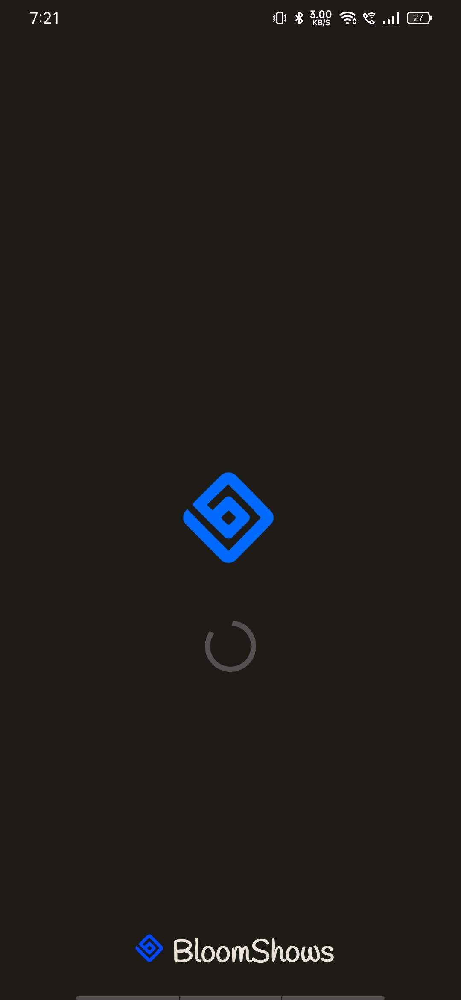
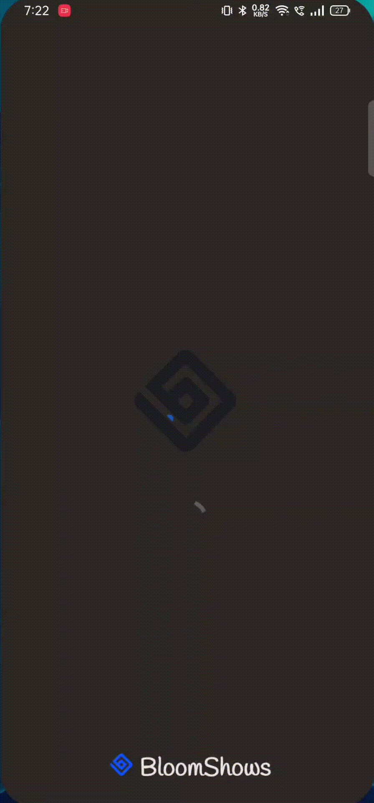
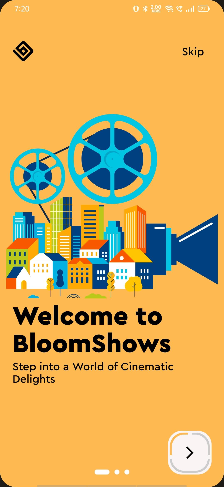
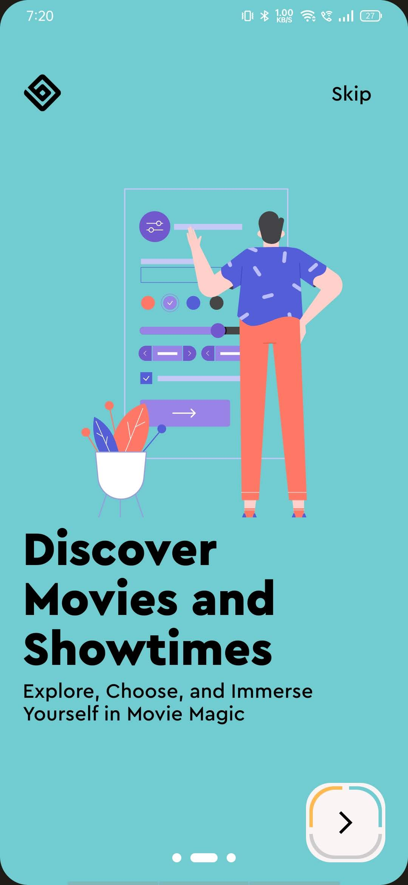
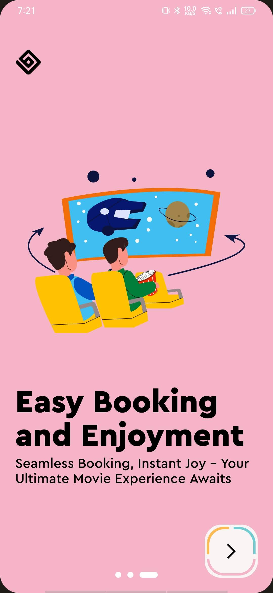
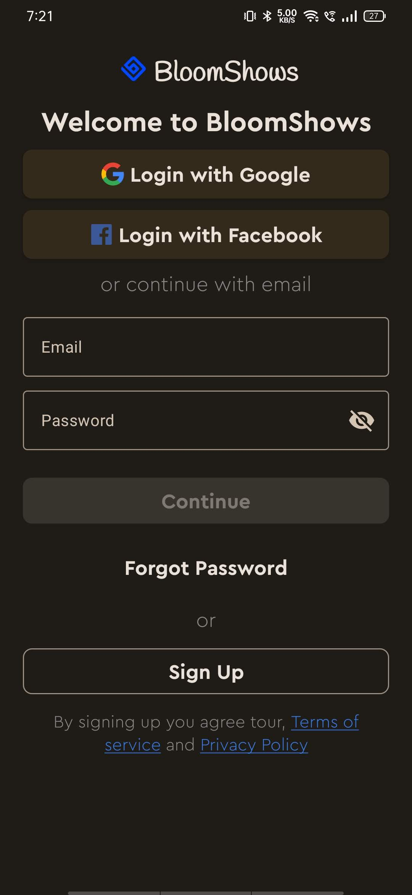
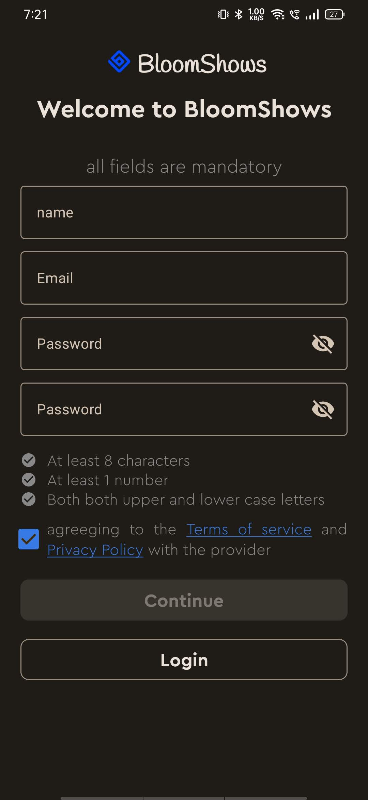
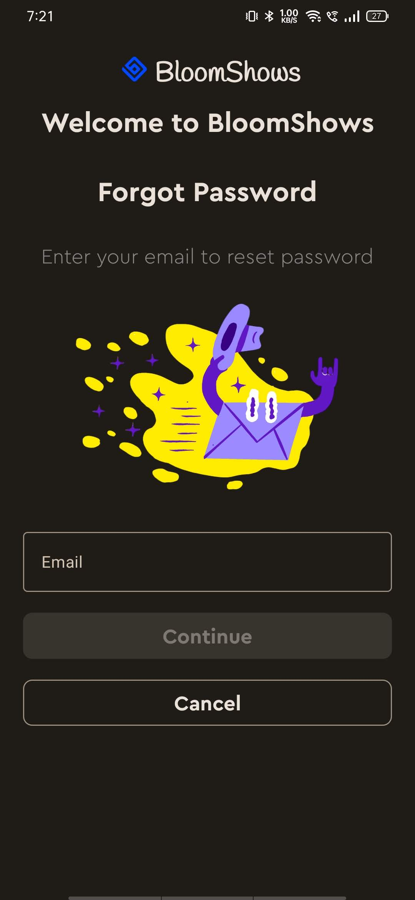

# BloomShows

#### Unlock Your Cinematic Journey: Seamless Booking, Endless Entertainment!

    <h2>UI Gallery</h2>

| SpashScreen                                                             |                                                                   |
|-------------------------------------------------------------------------|-------------------------------------------------------------------|
|  |  |

| OnBoarding                                                         |                                                                   |                                                                   |                                                                       |
|--------------------------------------------------------------------|-------------------------------------------------------------------|-------------------------------------------------------------------|-----------------------------------------------------------------------|
|  |  |  |  |

| Login/SignUp                                                     |                                                                   |                                                                   |                                                            |
|------------------------------------------------------------------|-------------------------------------------------------------------|-------------------------------------------------------------------|------------------------------------------------------------|
|  |  |  |  |

* before you start:
* add api key in local.properties
  > tmdb_api_key = "Your_Api_Key"
* add SHA1 to console and google-servies.json
    * in root directory of the project, inside the "app" directory:
